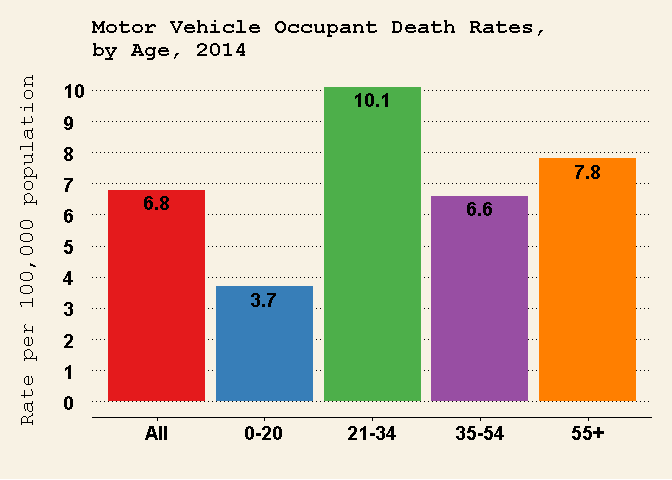
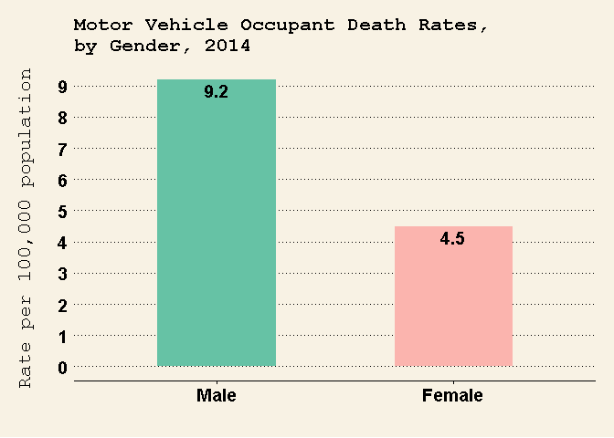

Data from the [National Highway Traffic Safety Administration](https://www.nhtsa.gov/), showed that 32,675 people in the United States of America died in motor vehicle crashes in 2014. There was a slight (0.7%) decline in motor vehicle occupant deaths in 2014, compared to the previous year. The data also revealed the following sobering statistics: \* There were approximately 90 deaths and 6,400 injuries from motor vehicle crashes every day. \* Motor vehicle crashes were the leading cause of death for young adults between the ages of 16 and 24. \* Approximately half of the passenger vehicle occupants that died (16,010) had no seat belts on. \* Alcohol-impaired driving was responsible for approximately 30% (9,967) of all the motor vehicle occupant deaths. \* Distracted driving was responsible for approximately 10% (3,179) of all motor vehicle occupant deaths

Data showed significant differences in the motor vehicle occupant death rate among different age groups and between males and females. Also, the motor vehicle occupant death rate varied widely among the 50 states.

Motor Vehicle Occupant Death Rates, by Age and Gender, 2014
-----------------------------------------------------------

In 2014, people aged 21-34 had the highest motor vehicle occupant death rate with 10.1 deaths per 100,000 population. Males (9.2 deaths per 100,000 population) were also more likely to die from motor vehicle crashes, compared to females (4.5 deaths per 100,000 population).

   

Data Source
-----------

Data was obtained from Fatality Analysis Reporting System (FARS), National Highway Traffic Safety Administration. More information on the data collection methods and procedures can be found [here](https://www.nhtsa.gov/research-data).

